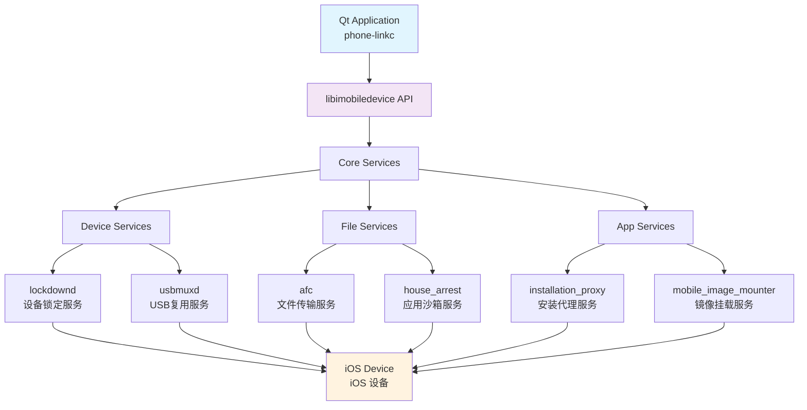

# libimobiledevice + Apple Mobile Device Support 能力总览

> 🍎 跨平台 iOS 设备通信库的完整功能指南与实践示例

## 简介

**libimobiledevice** 是一个跨平台的开源库，提供与 iOS 设备通信的原生协议实现，无需使用苹果官方的专有库。结合 **Apple Mobile Device Support** (AMDS)，可以实现对 iOS 设备的全面控制和数据交换。

### 核心优势

- 🔓 **无需越狱**: 通过合法的苹果协议与设备通信
- 🌐 **跨平台**: 支持 Windows、macOS、Linux
- ⚡ **高性能**: 原生 C/C++ 实现，性能优异
- 🔧 **功能全面**: 覆盖设备管理、应用安装、文件传输等

## 功能模块概览

### 1. 设备发现与连接 (Device Discovery & Connection)

#### 核心功能
- **设备枚举**: 自动发现 USB/WiFi 连接的 iOS 设备
- **配对管理**: 处理设备信任关系和配对证书
- **连接状态**: 监控设备连接状态变化
- **多设备支持**: 同时管理多个 iOS 设备

#### 技术能力
```
✅ USB 有线连接         ✅ WiFi 无线连接
✅ 设备热插拔检测       ✅ 自动重连机制
✅ 配对证书管理         ✅ SSL/TLS 安全通信
✅ 设备唯一标识 (UDID)  ✅ 连接池管理
```

### 2. 设备信息获取 (Device Information)

#### 系统信息
- **基础信息**: 设备型号、系统版本、序列号、UDID
- **硬件信息**: CPU 架构、内存大小、存储容量
- **网络信息**: IP 地址、MAC 地址、运营商信息
- **电池信息**: 电量、充电状态、健康度

#### 状态监控
- **实时信息**: CPU 使用率、内存占用、温度
- **应用状态**: 运行中的应用列表、前台应用
- **系统状态**: 锁屏状态、免打扰模式、飞行模式

### 3. 应用管理 (Application Management)

#### 应用安装与卸载
- **IPA 安装**: 支持企业签名和开发者签名应用
- **应用升级**: 增量升级和完整升级
- **批量操作**: 多应用并发安装/卸载
- **依赖管理**: 自动处理应用依赖关系

#### 应用信息查询
- **应用列表**: 获取已安装应用的详细信息
- **应用图标**: 提取和缓存应用图标
- **版本管理**: 跟踪应用版本历史
- **权限查询**: 获取应用权限设置

### 4. 文件系统操作 (File System Operations)

#### 文件传输
- **媒体文件**: 照片、视频、音频文件的双向传输
- **文档传输**: 支持各种文档格式
- **大文件支持**: 分块传输，支持断点续传
- **批量传输**: 多文件并发传输

#### 文件管理
- **目录浏览**: 浏览设备文件系统结构
- **文件操作**: 创建、删除、移动、重命名
- **权限管理**: 读取和修改文件权限
- **元数据**: 获取文件创建时间、修改时间等

### 5. 媒体与多媒体 (Media & Multimedia)

#### 照片管理
- **相册访问**: 读取和管理相册内容
- **照片导出**: 批量导出原图和缩略图
- **HEIC 支持**: 支持新格式照片处理
- **地理位置**: 提取照片 GPS 信息

#### 音视频处理
- **音乐库**: 访问 iTunes 音乐库
- **视频文件**: 处理各种视频格式
- **实时预览**: 设备屏幕镜像和录制
- **音频流**: 音频数据流处理

### 6. 通信与网络 (Communication & Network)

#### 网络代理
- **HTTP 代理**: 设置和管理 HTTP 代理
- **VPN 支持**: 配置和管理 VPN 连接
- **流量监控**: 监控网络流量使用情况
- **WiFi 管理**: WiFi 网络配置和连接

#### 消息处理
- **通知监听**: 监听系统通知和应用通知
- **消息转发**: 转发和处理设备消息
- **推送服务**: 与 APNs 集成
- **数据同步**: 实时数据同步机制

### 7. 安全与认证 (Security & Authentication)

#### 配对与信任
- **设备配对**: 自动化配对流程
- **证书管理**: 配对证书的生成和管理
- **信任验证**: 验证设备信任关系
- **安全通道**: 建立加密通信通道

#### 权限控制
- **访问控制**: 细粒度的功能访问控制
- **签名验证**: 验证应用和文件签名
- **沙箱支持**: 支持沙箱环境操作
- **企业管理**: 企业设备管理功能

## 架构与集成

### 系统架构



### 集成方式

#### CMake 集成
```cmake
# 查找 libimobiledevice
find_package(PkgConfig REQUIRED)
pkg_check_modules(IMOBILEDEVICE REQUIRED libimobiledevice-1.0)
pkg_check_modules(PLIST REQUIRED libplist-2.0)

# 链接库
target_link_libraries(${PROJECT_NAME}
    ${IMOBILEDEVICE_LIBRARIES}
    ${PLIST_LIBRARIES}
)

# 包含目录
target_include_directories(${PROJECT_NAME}
    PRIVATE
    ${IMOBILEDEVICE_INCLUDE_DIRS}
    ${PLIST_INCLUDE_DIRS}
)
```

#### Qt 项目集成
```pro
# .pro 文件配置
CONFIG += link_pkgconfig
PKGCONFIG += libimobiledevice-1.0 libplist-2.0

# 或直接链接
unix: LIBS += -limobiledevice -lplist
win32: LIBS += -limobiledevice -lplist
```

## 实际应用场景

### 1. 设备管理工具
- **企业设备管理**: 批量管理企业 iOS 设备
- **开发者工具**: 应用测试和部署工具
- **IT 运维**: 设备状态监控和维护
- **数据迁移**: 设备间数据迁移工具

### 2. 多媒体应用
- **照片管理**: 专业照片整理和备份工具
- **音视频处理**: 多媒体内容管理平台
- **屏幕镜像**: 设备屏幕投屏应用
- **直播工具**: 移动设备直播解决方案

### 3. 开发与测试
- **自动化测试**: iOS 应用自动化测试框架
- **性能监控**: 应用性能实时监控
- **调试工具**: 高级调试和分析工具
- **CI/CD 集成**: 持续集成部署流水线

### 4. 数据分析
- **使用分析**: 设备和应用使用情况分析
- **性能分析**: 系统性能数据收集
- **行为分析**: 用户行为数据挖掘
- **安全审计**: 安全状态监控和审计

## 性能特点

### 通信性能
- **连接建立**: < 2 秒（USB），< 5 秒（WiFi）
- **文件传输**: 高达 40 MB/s（USB 3.0）
- **并发连接**: 支持最多 16 个同时连接
- **内存占用**: < 50 MB（单设备连接）

### 兼容性
- **iOS 版本**: iOS 7.0 - iOS 17.x
- **设备支持**: iPhone、iPad、iPod Touch
- **系统平台**: Windows 7+、macOS 10.12+、Linux

### 稳定性
- **错误恢复**: 自动重连和错误恢复机制
- **内存管理**: 完善的内存泄漏防护
- **并发安全**: 线程安全的 API 设计
- **异常处理**: 完整的异常处理体系

## 开发建议

### 最佳实践
1. **连接管理**: 使用连接池管理多设备连接
2. **错误处理**: 实现完善的错误处理和重试机制
3. **性能优化**: 合理使用缓存和异步操作
4. **用户体验**: 提供进度反馈和操作取消功能

### 安全考虑
1. **权限最小化**: 只请求必要的设备权限
2. **数据加密**: 敏感数据传输加密处理
3. **证书管理**: 安全存储和管理配对证书
4. **隐私保护**: 遵循数据隐私保护规范

### 调试技巧
1. **日志记录**: 启用详细的调试日志
2. **网络抓包**: 使用 Wireshark 分析通信协议
3. **性能分析**: 使用 Instruments 进行性能分析
4. **内存检测**: 使用 Valgrind 检测内存问题

## 许可证与法律

### 开源许可
- **libimobiledevice**: LGPL-2.1+ 许可证
- **商业使用**: 允许商业项目使用
- **分发要求**: 遵循 LGPL 分发要求
- **专利保护**: 提供专利保护条款

### 合规性
- **苹果政策**: 符合苹果开发者协议
- **隐私法规**: 遵循 GDPR、CCPA 等隐私法规
- **出口管制**: 注意加密技术出口限制
- **企业合规**: 满足企业安全和合规要求

## 社区与支持

### 官方资源
- **项目主页**: https://libimobiledevice.org/
- **源代码**: https://github.com/libimobiledevice/libimobiledevice
- **文档**: https://docs.libimobiledevice.org/
- **API 参考**: https://www.libimobiledevice.org/docs/

### 社区支持
- **邮件列表**: libimobiledevice-devel@lists.libimobiledevice.org
- **Issue 跟踪**: GitHub Issues
- **Stack Overflow**: 标签 `libimobiledevice`
- **Reddit**: r/jailbreakdevelopers

---

> 💡 **提示**: libimobiledevice 是一个功能强大的工具，但使用时需要遵循相关法律法规和苹果的开发者协议。建议在开发前仔细阅读相关文档和许可证条款。
